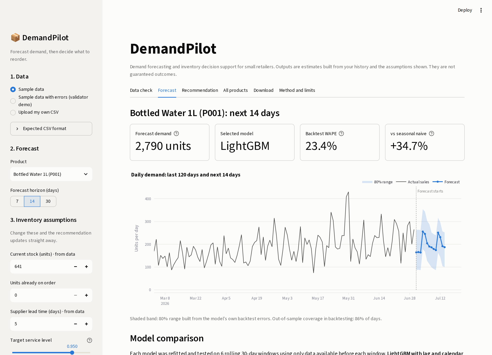
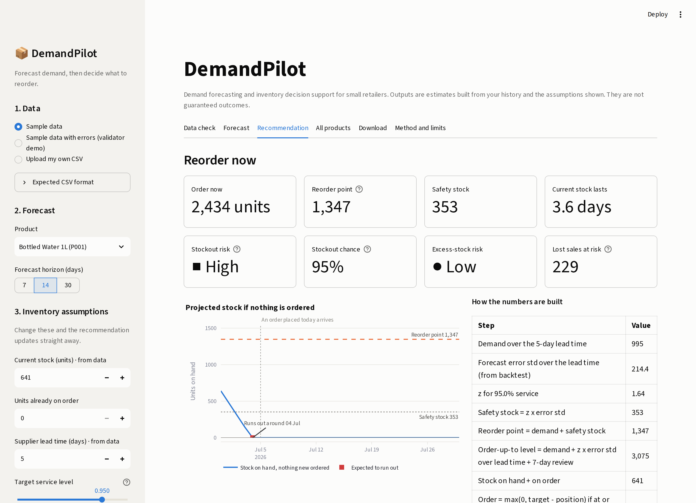
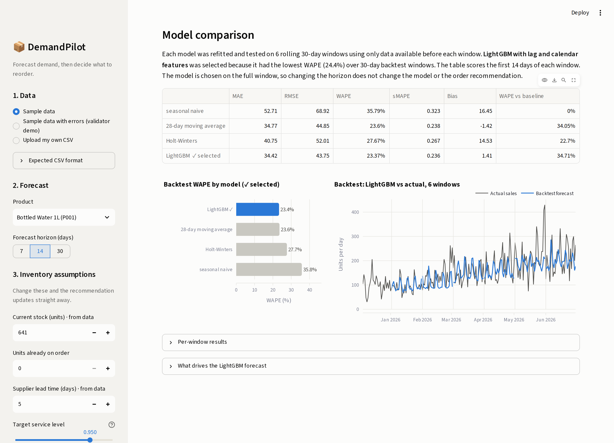
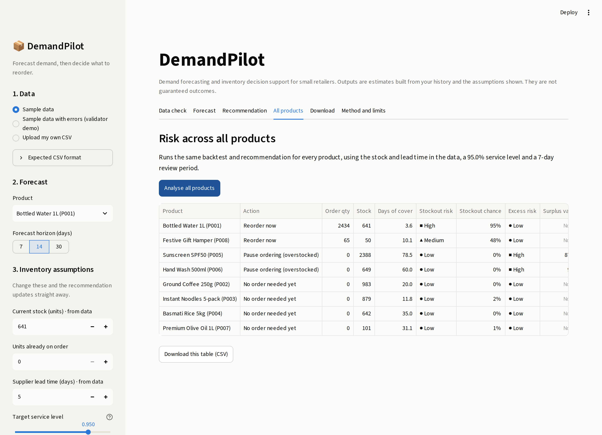
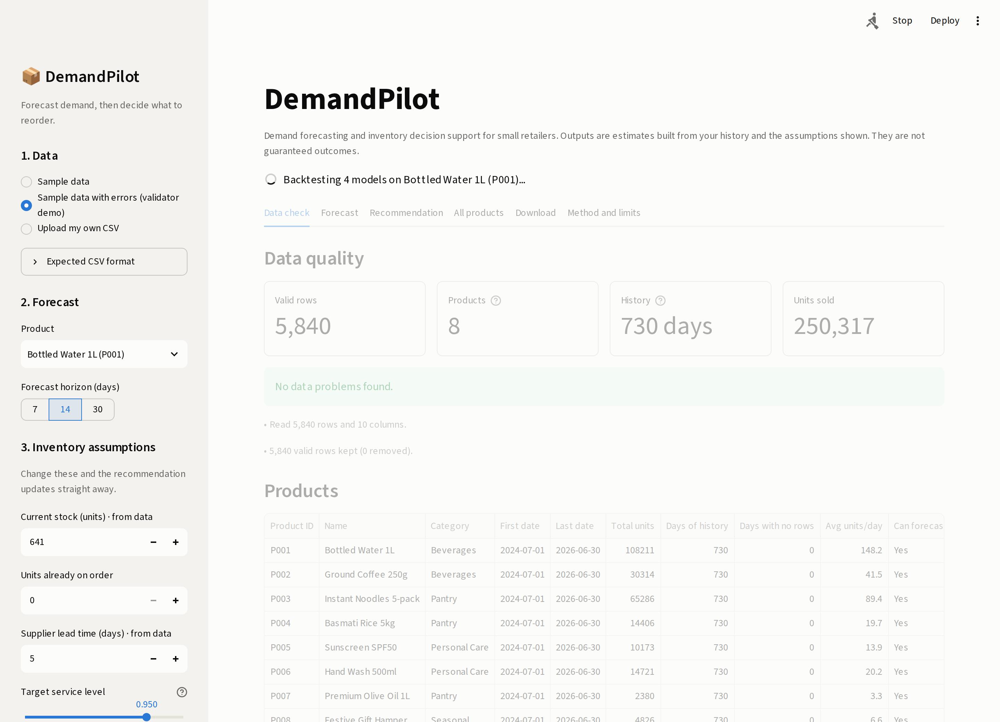
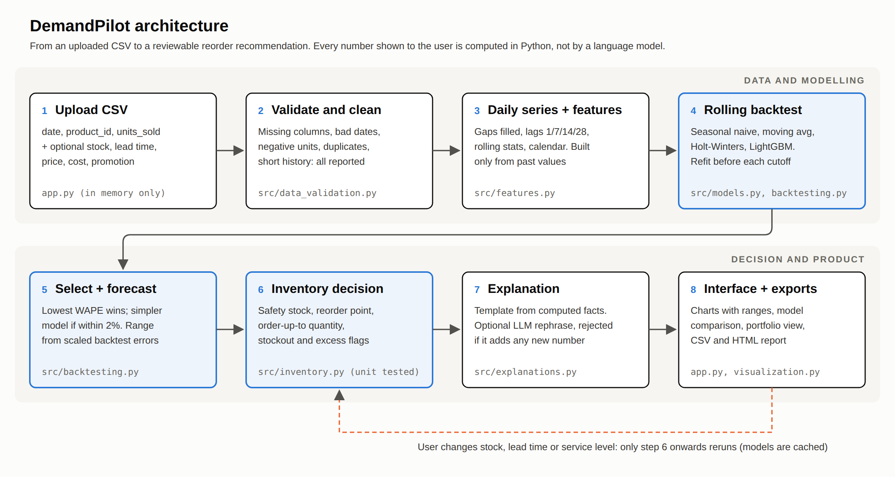

# DemandPilot

**Demand forecasting and inventory decision support for small retailers.**

Upload daily sales as a CSV, pick a product, and DemandPilot will check the data, compare four forecasting models on a time-aware backtest, forecast the next 7, 14 or 30 days with an uncertainty range, and turn that forecast into a reorder recommendation you can inspect line by line.

It is built for someone who manages stock but does not have a data team. Every number on screen comes from code in this repository, every assumption is shown, and the app says clearly when it is unsure.



## Contents

- [Why this project](#why-this-project)
- [What it does](#what-it-does)
- [Quick start](#quick-start)
- [Results](#results)
- [How it works](#how-it-works)
- [Preventing time-series leakage](#preventing-time-series-leakage)
- [Inventory formulas](#inventory-formulas)
- [Limitations](#limitations)
- [Project structure](#project-structure)
- [Tests](#tests)
- [Deployment](#deployment)

## Why this project

Most forecasting demos stop at a chart. A store manager does not need a chart, they need to know whether to order today and how much. The interesting part of this project is the join between the two: how forecast error turns into safety stock, and how a model's uncertainty should change a business decision.

I also wanted the evaluation to be honest. The seasonal-naive baseline is mandatory, models are picked by backtest results and not by how advanced they sound, and the headline numbers below come from a holdout period that model selection never saw.

## What it does

1. **Shows the expected CSV format** and offers a template download.
2. **Validates the upload** and reports missing columns, invalid dates, negative or non-numeric units, duplicate rows and products with too little history. Nothing is fixed silently.
3. **Summarises the data**: rows, products, history length, gaps and weekly sales.
4. **Forecasts** one product over 7, 14 or 30 days after comparing four models on rolling 30-day backtests. Switching the horizon changes what is charted and scored, never the chosen model or the order recommendation.
5. **Charts** history, forecast and an 80% range, plus the backtest itself so you can see how the model did in the past.
6. **Recommends** an order quantity with safety stock, reorder point, stockout probability and an excess-stock flag.
7. **Updates instantly** when you change current stock, units on order, lead time, service level or review period. Models are cached, so only the decision layer reruns.
8. **Explains** the result in plain language, built by a template from computed values. An optional language model can rephrase it, but its answer is thrown away unless it keeps exactly the template's numbers, in the same order, and the same recommended action.
9. **Ranks all products** by stockout and excess risk.
10. **Exports** the forecast and recommendation as CSV, plus a printable HTML report.

| Recommendation | Model comparison |
|---|---|
|  |  |
| **All products** | **Validation on a messy file** |
|  |  |

## Quick start

Needs Python 3.10 or newer.

```bash
python -m venv .venv
# Windows: .venv\Scripts\activate      macOS/Linux: source .venv/bin/activate
pip install -r requirements.txt
streamlit run app.py
```

The app opens at http://localhost:8501 with the sample data already loaded. No API key is needed.

To regenerate the sample data or rerun the evaluation:

```bash
python scripts/generate_sample_data.py   # writes data/sample_sales.csv and data/sample_sales_with_issues.csv
python scripts/evaluate.py               # writes reports/evaluation_summary.md (about a minute)
pip install -r requirements-dev.txt && pytest
```

### Data format

| Column | Required | Notes |
|---|---|---|
| `date` | Yes | Any common date format |
| `product_id` | Yes | Stable SKU identifier |
| `units_sold` | Yes | Non-negative. Several rows for one product and day are summed |
| `current_stock` | Optional | The latest non-empty value per product is used |
| `lead_time_days` | Optional | A labelled default of 7 days is used if missing |
| `unit_price`, `unit_cost` | Optional | For lost-sales and surplus-value estimates |
| `promotion` | Optional | 1/0, true/false or yes/no |
| `category`, `product_name` | Optional | Display only |

The included `data/sample_sales.csv` is **synthetic**: 8 products, 730 days (July 2024 to June 2026), 5,840 rows, generated by `scripts/generate_sample_data.py` with weekly patterns, yearly seasonality, promotions, trends, a slow mover and a festive product. `data/sample_sales_with_issues.csv` is the same data with deliberate errors for testing the validator.

## Results

All numbers here are produced by `python scripts/evaluate.py` and written to [`reports/evaluation_summary.md`](reports/evaluation_summary.md).

**Setup.** Backtest windows are 30 days long. For each of the 8 synthetic products, one model is chosen using 6 rolling windows, with the same rule the app uses. It is then scored on the next 4 windows, which selection never saw, refitting at each holdout cutoff on everything before it. The 7- and 14-day rows score the first 7 or 14 days of each window. WAPE is total absolute error divided by total actual units, pooled across products.

| Horizon | DemandPilot (model selected per product) | Seasonal naive baseline | Relative reduction in WAPE |
|---|---|---|---|
| 7 days | 27.0% | 40.9% | 34.0% |
| 14 days | 25.9% | 39.0% | 33.6% |
| 30 days | 27.7% | 37.9% | 27.0% |

The selected model beat the seasonal-naive baseline for all 8 products at all three horizons (24 of 24).

**Prediction ranges.** The 80% range contained the actual value on 73% to 77% of holdout days on average, and on as few as 46% of days for one product at 7 days. So the ranges run narrow, and the app shows the measured coverage under the forecast chart.

**Safety stock.** For each holdout window I checked whether actual demand over the next 7 or 14 days stayed within forecast plus a 95% safety stock. With the app's method (errors summed over the lead time), it did in all 32 windows at both lead times. The textbook √lead-time rule also covered 32 of 32 and 31 of 32 while holding 31% to 43% less safety stock. On this data the app's method is more cautious than it needs to be. 32 windows is a small sample, so I kept the method that does not assume independent daily errors, and I report the cost.

**What the results actually say.**

- Every smoothed model (moving average, Holt-Winters, LightGBM) beat the seasonal-naive baseline by a similar margin. Most of the gain comes from not copying one noisy week forward.
- Per-product selection was slightly better than the best single fixed model at 14 and 30 days, by under one point of WAPE (25.9% vs 26.5% for LightGBM everywhere at 14 days), and level with it at 7 days. With 4 holdout windows, that difference is within noise.
- LightGBM was not a clear winner. On noisy daily retail data with two years of history, the simple and classical methods held up well. I report that as a result, not a failure.
- These are synthetic data. The numbers show that the pipeline works and is evaluated fairly. They say nothing about accuracy for a real shop.

## How it works



| Layer | File | What it does |
|---|---|---|
| Interface | `app.py` | Streamlit app: upload, controls, tabs, downloads |
| Validation | `src/data_validation.py` | Schema checks, cleaning with reporting, daily aggregation, gap filling |
| Features | `src/features.py` | Lags, rolling statistics, calendar, promotion and price features |
| Models | `src/models.py` | Seasonal naive, 28-day moving average, Holt-Winters, LightGBM |
| Evaluation | `src/backtesting.py` | Rolling-origin backtest, metrics, model selection, intervals |
| Decisions | `src/inventory.py` | Safety stock, reorder point, order quantity, risk flags |
| Explanation | `src/explanations.py` | Template explanation and the optional, number-checked LLM rephrase |
| Charts | `src/visualization.py` | Plotly charts |
| Exports | `src/reporting.py` | CSV tables and the HTML report |

**Models.**

| Model | Why it is here |
|---|---|
| Seasonal naive | Baseline. Repeats last week. Anything more complex has to beat it |
| 28-day moving average | Very simple and stable. A strong baseline for noisy demand |
| Holt-Winters (damped additive trend, weekly seasonality) | Classical and interpretable |
| LightGBM (Poisson objective) | Learns from lags 1/7/14/28, rolling means and standard deviations, a short-vs-long trend ratio, day of week, day of month, week, month, day of year, promotion and price. Forecasts one day at a time and feeds each prediction back as the next lag |

**Selection.** Lowest WAPE over the full 30-day backtest windows wins, unless a simpler model is within 2% (relative) of it. The accuracy shown inside the app comes from the same windows used for this choice, so it is slightly optimistic. The holdout results above avoid that.

**Uncertainty.** The 80% range comes from the selected model's own backtest errors. Errors are divided by the demand level at each backtest cutoff and rescaled to today's level, so a product heading into its busy season gets a wider range. Coverage is measured out of sample: each window's range is built only from earlier windows' errors.

## Preventing time-series leakage

Random train/test splits are not used anywhere. In a forecasting problem they let the model train on days that come after the days it is tested on, which makes accuracy look better than it will be in real use.

What the code does instead:

1. **Expanding-window backtest.** At each cutoff the model is refitted on rows strictly before the cutoff (`assert train.index.max() < test.index.min()` in `backtest`), then forecasts the whole window in one go. The demand level used to scale errors is also computed from training rows only.
2. **Features only look back.** Lags and rolling statistics are built from the series shifted by one day. `tests/test_forecasting.py` changes every value from day 100 onwards and checks that features for days up to 100 do not move.
3. **No peeking at future covariates.** In backtests the model does not see promotion flags or prices from the test window. It assumes no promotion and the last regular price, which is exactly what it has to do when forecasting for real. Missing prices are only filled forwards, never backwards from later dates.
4. **Multi-step forecasts use predictions, not actuals.** LightGBM's lag features inside the forecast window are filled with its own earlier predictions. A test swaps the final test window's actuals for 5,000 and checks that the forecasts do not change.
5. **Reported accuracy comes from an untouched holdout.** `scripts/evaluate.py` picks models on earlier windows and reports on later ones.

## Inventory formulas

All formulas are standard and visible in the app's "How the numbers are built" table.

| Quantity | Formula |
|---|---|
| Lead-time demand D_L | Sum of the daily forecast over the next L days |
| Lead-time error σ_L | Measured from the backtest: root mean square of the selected model's forecast errors summed over every run of L consecutive days, scaled to today's demand level. Beyond 30 days it is extended with the √ rule |
| Safety stock SS | z(service level) × σ_L |
| Reorder point ROP | D_L + SS |
| Order-up-to level S | D_(L+R) + z × σ_(L+R), where R is the review period |
| Order quantity | max(0, S − (on hand + on order)) when on hand + on order ≤ ROP, else 0 |
| Stockout probability | P(lead-time demand > on hand + on order), normal approximation |
| Expected shortfall | σ_L × [φ(k) − k(1 − Φ(k))], the standard normal loss function |
| Surplus | max(0, position − S). Flagged when position / S exceeds a set threshold (1.5 by default) |

Stockout risk is **High** when stock plus on-order is below expected lead-time demand, **Medium** when it is below the reorder point, and **Low** otherwise. These functions have their own unit tests in `tests/test_inventory.py`, separate from the interface.

Measuring σ_L from summed errors, instead of the textbook daily error × √L, keeps any day-to-day correlation and bias in the errors. The policy is a common hybrid: a continuous-review reorder point decides *when* to order, and an order-up-to level covering lead time plus review period decides *how much*.

## Limitations

- **Synthetic data.** The sample data was generated for this project. No real business is involved and no business impact is claimed.
- **Sales are treated as demand.** When a product was out of stock, real demand was higher than recorded sales. The model cannot see this.
- **Missing days count as zero sales.** This fits most point-of-sale exports but is wrong if the store was closed. Days after a product's last row, up to the end of the file, count as zero too, and the app flags it.
- **Safety stock looks cautious.** On the holdout, the measured lead-time error covered demand in every window, more often than the 95% target. It is estimated from a limited number of backtest windows, so it is itself uncertain.
- **Normal approximation.** Stockout probability and expected shortfall assume roughly normal errors, which is rough for slow or intermittent sellers. The app warns when sales are intermittent.
- **Fixed lead time.** Supplier delays and lead-time variability are not modelled.
- **No planned promotions.** Future promotions and price changes are assumed away. A retailer usually knows its promotion calendar, so this is the first thing I would add.
- **Ranges run narrow.** Average holdout coverage was 73% to 77% for a nominal 80% range, lower for some products.
- **One model per product.** Products do not share information, so new products with very little history cannot be forecast.
- **Decision support, not automation.** Recommendations are meant to be reviewed by a person.

## Project structure

```
demandpilot/
├── app.py                          Streamlit application
├── src/
│   ├── data_validation.py          schema and quality checks, daily aggregation
│   ├── features.py                 time-series features
│   ├── models.py                   baseline and candidate models
│   ├── backtesting.py              rolling backtests, metrics, selection, intervals
│   ├── inventory.py                safety stock and reorder logic
│   ├── explanations.py             template and optional LLM explanations
│   ├── visualization.py            charts
│   ├── reporting.py                CSV and HTML exports
│   └── pipeline.py                 glue used by the app and scripts
├── scripts/
│   ├── generate_sample_data.py     synthetic data generator
│   ├── evaluate.py                 holdout evaluation, writes reports/ (and artifacts/ with --save-models)
│   ├── capture_screenshots.py      README screenshots
│   └── record_demo.py              silent demo video with captions
├── tests/                          pytest suite
├── data/                           synthetic sample CSVs
├── reports/                        evaluation output
├── assets/                         screenshots, architecture diagram, demo video
├── docs/                           write-up, demo script, deployment guide, résumé entry
├── requirements.txt / requirements-dev.txt
├── .env.example                    variable names only
├── Dockerfile
└── LICENSE
```

## Tests

```bash
pip install -r requirements-dev.txt
pytest
```

The suite covers validation (bad dates, negatives, duplicates, gaps, short history, file types), the inventory formulas against hand-calculated values, leakage checks for features and backtests, the measured lead-time error, model output shape and non-negativity, model selection, edge cases (all-zero sales, short histories, products that stop selling, very long lead times, a horizon switch that must not change the recommendation), and the explanation layer including rejection of language-model answers that change a number or the action.

## Deployment

The simplest option is Streamlit Community Cloud (free): push this repository to GitHub, create a new app pointing at `app.py`, and deploy. No secrets are required. Full steps, plus Docker and local options, are in [`docs/deployment.md`](docs/deployment.md).

### Optional language-model rephrasing

Copy `.env.example` to `.env` (or use Streamlit secrets), set `DEMANDPILOT_LLM_PROVIDER=anthropic` and `ANTHROPIC_API_KEY`, and `pip install anthropic`. A toggle then appears under the explanation. The model only receives the template text. Unless its answer keeps exactly the template's numbers in the same order, writes them as digits and keeps the recommended action, the app falls back to the template. This check is strict on purpose; it can still miss a reworded meaning, which is why the numbers and the action are always shown separately in the app.

## Security and data handling

- Uploaded files are processed in memory and never written to disk.
- File type, size (25 MB limit), schema and numeric ranges are checked before processing.
- `.env` and Streamlit secrets are git-ignored. Only `.env.example` with empty values is committed.
- The app works fully without any external service.

## Further documentation

- [`docs/technical_writeup.md`](docs/technical_writeup.md): model comparison, leakage prevention, limitations and lessons learned
- [`docs/demo_script.md`](docs/demo_script.md): two-minute demo video script (a silent captioned walkthrough is in `assets/demo_walkthrough.mp4`)
- [`docs/resume_entry.md`](docs/resume_entry.md): résumé bullets and interview notes, using only verified numbers
- [`docs/deployment.md`](docs/deployment.md): deployment guide

## License

MIT. See [LICENSE](LICENSE).
